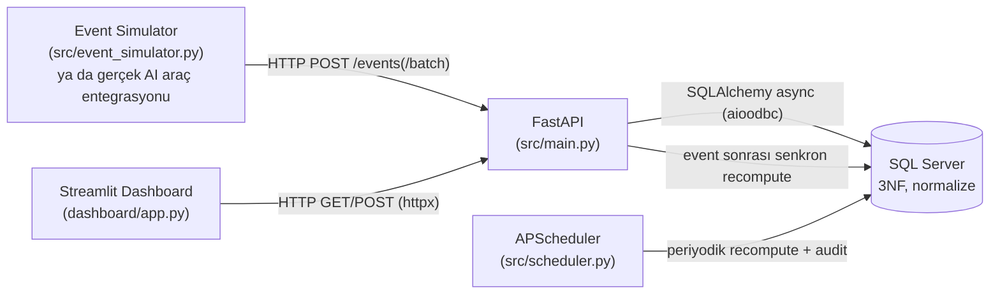

# Mimari

## Genel Akış

Dashboard veritabanına **hiçbir zaman** doğrudan bağlanmaz; API'nin bir
istemcisi gibi davranır. Bu, servis katmanının tek gerçek kaynak (source of
truth) olmasını garanti eder ve ileride ikinci bir istemci (örn. mobil uygulama,
Slack botu) eklendiğinde aynı iş kurallarının tekrar yazılmasını engeller.

Üçü de (`sqlserver`, `api`, `dashboard`) tek bir `docker compose up --build`
ile ayağa kalkar -- projeyi inceleyecek herkes kendi bilgisayarında, hiçbir
Python/ODBC kurulumu yapmadan, sadece Docker Desktop ile çalıştırabilir.
`api` container'ı açılırken önce `scripts/ensure_database.py` ile hedef
veritabanını oluşturur, sonra `alembic upgrade head` ile şemayı uygular.

## Neden Medalyon Mimarisi Değil?

Bu değerlendirmenin ikinci case'i (satış/satınalma/ERP verisiyle Power BI'a
giden hat) bilinçli olarak medalyon (bronze/silver/gold) ve batch ETL
mimarisini kullanıyor -- çünkü o senaryoda veri kaynağı periyodik export'lar
(ERP, dosya tabanlı entegrasyonlar) ve tüketici bir BI aracı. Orada doğru
soru "veriyi nasıl temizleyip katmanlar halinde biriktiririz" sorusudur.

Bu projede ise soru farklı: **"AI kullanım verisi bir üründe nasıl gerçek
zamanlıya yakın işlenir?"** Bu iki mimari kasıtlı olarak farklı, çünkü
gerçek dünyada da öyle:

| Boyut | Medalyon / Batch (Case 2) | OLTP / API-first (Case 1 - bu proje) |
|---|---|---|
| Veri kaynağı | Periyodik export/dosya | Uygulama event'leri (API çağrıları) |
| Gecikme | Saatlik/günlük batch pencereleri kabul edilebilir | Dakikalar içinde güncel olmalı |
| Şema | Yıldız şema, surrogate key, boyut/olgu ayrımı | 3NF normalize, doğal `id` |
| Kalite kontrolü | Genellikle silver katmanında toplu doğrulama | Write-time (Pydantic + CHECK constraint) + periyodik audit |
| Tüketici | Power BI / raporlama | Kendi API'si + dashboard (canlı ürün) |
| Amaç | Analitik/raporlama optimizasyonu | Servis olarak çalışan bir ürünün davranışını göstermek |

Bir AI kullanım olgunluk skorunun "dün gece hesaplandı" olması, ürünün
değer önerisiyle çelişir: yöneticinin bugün gördüğü skorun bugünkü
davranışı yansıtması beklenir. Bu yüzden medalyon/batch yerine event-driven,
API-first bir servis mimarisi tercih edildi.

## Veri Kalitesi Yaklaşımı: Write-Time + Audit

Batch/medalyon dünyasında veri kalitesi genelde "kirli veri gelir, sonradan
temizleriz" mantığıyla çalışır. OLTP/API-first bir serviste bu prensip
tersine döner: **kirli verinin sisteme hiç girmemesi** tercih edilir.

- **Write-time**: Pydantic şema doğrulaması (`extra="forbid"` ile içerik
  alanlarının reddi dahil) ve veritabanı `CHECK` constraint'leri (örn.
  `directive_language_ratio BETWEEN 0 AND 1`) hatalı veriyi transaction
  seviyesinde reddeder.
- **Periyodik audit** (`src/quality_checks.py`): Referans bütünlüğü,
  duplicate event, freshness (tazelik) ve anomali taraması gibi, tek bir
  yazma işleminde yakalanamayacak, zaman içinde ortaya çıkan sorunları
  tarar. Sonuçlar `quality_check_runs` tablosuna yazılır ve
  `GET /quality/report` ile dashboard'da gösterilir.

## Skor Güncelleme Stratejisi

1. **Senkron (near-real-time)**: `POST /events` sonrası, ilgili çalışanın
   son 30 günlük penceresi için skor hemen yeniden hesaplanır
   (`src/scoring_service.py`). Küçük/orta veri hacminde bu sorgu ucuzdur.
2. **Periyodik güvenlik ağı**: `APScheduler` (`src/scheduler.py`) her N
   dakikada bir tüm çalışanların skorlarını yeniden hesaplar ve veri
   kalitesi denetimini tetikler. Bu, senkron yoldan kaçırılmış olabilecek
   durumları (örn. kısmi hata sonrası) telafi eder.

Bu tasarım, "batch job her gece çalışır" modelinden kasıtlı olarak
uzaklaşır: skor her zaman "yakın zamanda güncellenmiş" durumdadır.

## Gizlilik İlkesi Kod Seviyesinde Nasıl Uygulanıyor?

"İçerik değil, davranış analiz edilir" ilkesi üç katmanda zorlanır:

1. **Veri modeli** (`src/models.py`): `InteractionEvent` tablosunda
   içerik/metin sütunu yok.
2. **API şeması** (`src/schemas.py`): `InteractionEventCreate` modeli
   `extra="forbid"` kullanır ve `content`, `text`, `prompt`, `response`,
   `message`, `raw_text`, `body` gibi alan adlarını açıkça reddeder.
3. **Dokümantasyon**: `/docs` (Swagger) üzerinden şema açıkça görülebilir --
   bir denetçi ya da mülakatçı, prompt saklamanın mimari olarak mümkün
   olmadığını şemaya bakarak doğrulayabilir.

## Veritabanı Motoru: SQL Server

Bu proje SQL Server üzerinde çalışır (SQLAlchemy 2.0 async + `aioodbc`/`pyodbc`,
ODBC Driver 18). Motor tercihinin OLTP/API-first mimari kararıyla bir ilgisi
yok -- aynı gerekçeler (event-driven, near-real-time, write-time doğrulama)
Postgres için de geçerli olurdu. Birkaç SQL Server'a özgü nokta:

- **ENUM yok**: SQL Server'da native enum tipi bulunmadığından, Python
  `Enum`'ları `_enum_column()` (bkz. `src/models.py`) ile VARCHAR + CHECK
  constraint olarak modellenir; `values_callable` ile DB'ye her zaman
  enum'un `.value`'su yazılır (`.name` değil -- aksi halde ad/değer farklı
  olduğunda, örn. `Archetype`, geçersiz değer hatası alınır).
- **Zaman damgaları naive-UTC**: `DATETIMEOFFSET`'in getirdiği karmaşıklıktan
  kaçınmak için tüm zaman damgaları `DATETIME2` (saat dilimsiz) olarak
  tutulur; uygulama her zaman `src/utils.py::utcnow()` ile naive-UTC üretir,
  API katmanı gelen saat dilimli değerleri (varsa) bu forma normalize eder.
- **MARS (Multiple Active Result Sets) zorunlu**: SQLAlchemy'nin async ORM
  kullanım desenleri aynı bağlantı üzerinde iç içe sorgular açabiliyor;
  SQL Server ODBC bağlantılarında bu varsayılan olarak kapalıdır ve
  `MARS_Connection=yes` olmadan "bağlantı başka bir komutun sonuçlarıyla
  meşgul" hatası alınır -- tüm bağlantı dizelerinde bu parametre zorunlu.
- **`GROUP BY` Postgres kadar esnek değil**: SQL Server, karmaşık bir ifadeyi
  hem `SELECT` hem `GROUP BY`'da aggregate'lerle yan yana kullanınca bazen
  eşleştiremiyor (bkz. `GET /scores/trend`); bu yüzden hesaplanan "bucket"
  ifadesi önce bir alt sorguda üretilip dışarıdan gruplanır.
- **`GETUTCDATE()` transaction-sabit değil**: Postgres'in `now()`'ının aksine,
  aynı transaction içindeki her INSERT ifadesi için ayrı ayrı değerlendirilir;
  bu yüzden `run_all_quality_checks()` bir koşudaki tüm kontrol satırlarına
  aynı zaman damgasını Python tarafında (DB'ye güvenmeden) atar.
- **`VARCHAR` Türkçe karakterleri sessizce kaybeder**: Serbest metin
  kolonları (takım/çalışan/araç adı, rol, kalite denetim mesajları) ilk
  halde `String`/`Text` (-> `VARCHAR`) ile tanımlanmıştı; SQL Server'ın
  varsayılan koleksiyonu `ş`, `ğ`, `ı`, `İ` gibi Türkçe'ye özgü karakterleri
  Latin1/CP1252'de karşılığı olmadığı için en yakın ASCII karaktere
  indirgiyordu (örn. "Mühendisliği" -> "Mühendisligi", "Diğer" -> "Diger").
  Bu, gerçek veriyle test edilirken fark edilen gerçek bir hataydı; düzeltme
  `sqlalchemy.Unicode`/`UnicodeText` (-> `NVARCHAR`/`NVARCHAR(max)`)
  kullanmaktı -- SQL Server ile Türkçe metin tutan her projede akılda
  tutulması gereken bir nokta.

## Maliyet & Verimlilik: Ayrı Bir Analiz Katmanı

Her event'in girdi/çıktı token sayısı da tutulur (`interaction_events.
input_tokens/output_tokens`) -- bunlar içerik değil, bir dosyanın boyutu
gibi salt sayısal kullanım ölçümleridir, bu yüzden "içerik değil, davranış"
ilkesini bozmaz. Maliyet, `config/pricing.yaml`'daki araç başına USD
fiyatlarından `src/cost_service.py` içinde isteğe bağlı (on-the-fly)
hesaplanır -- DB'de ayrıca saklanmaz, tıpkı skor ağırlıklarının
`weights.yaml`'da tutulup migration gerektirmemesi gibi.

Bilinçli bir tasarım kararı: maliyet/verimlilik, mevcut 6 boyutlu kompozit
olgunluk skorunun ağırlıklarına **karıştırılmaz** -- ayrı, tamamlayıcı bir
analiz katmanı (`GET /costs/*`, dashboard'da "Maliyet & Verimlilik" sekmesi)
olarak sunulur. Bu, halihazırda savunulan skor metodolojisini yeniden
tartışmaya açmadan yeni bir soruya ("ne kadar harcadık, ne kadarı verimli
kullanıldı") cevap vermeyi sağlar.
