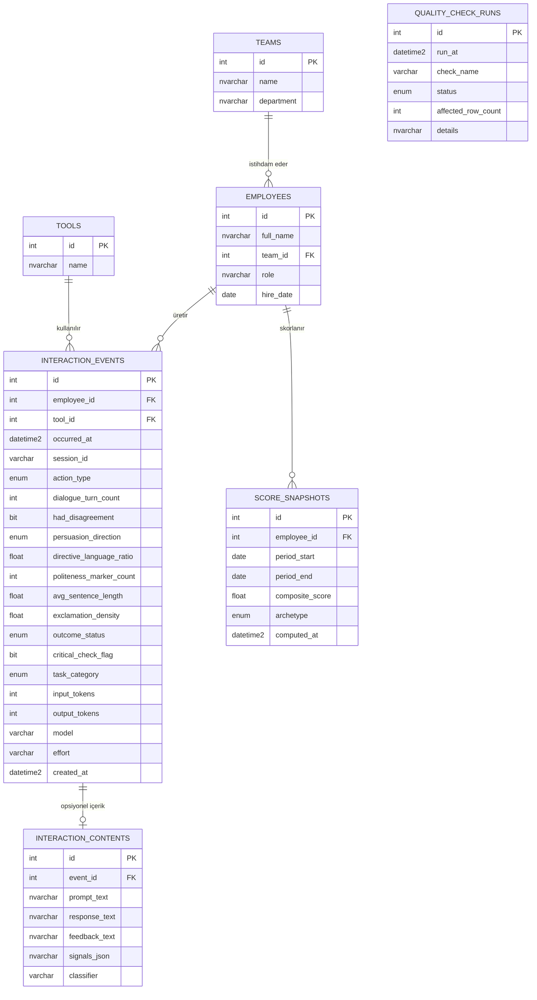

# Veri Sözlüğü

Veritabanı: SQL Server. `enum` olarak işaretlenen kolonlar fiziksel olarak
`nvarchar` + `CHECK` constraint'tir (SQL Server'da native enum tipi yok);
tüm zaman damgaları saat dilimsiz (`datetime2`) ve daima UTC olarak tutulur;
kullanıcıya gösterim ve Excel'den okunan saat dilimsiz girdiler Türkiye
saatine (`Europe/Istanbul`, UTC+3) göre çevrilir (`LOCAL_TIMEZONE` /
`DISPLAY_TIMEZONE`).
Serbest metin kolonları (isim, takım, rol...) **`nvarchar`** (Unicode) --
`varchar` değil -- çünkü `varchar`'ın varsayılan koleksiyonu Türkçe'ye özgü
`ş`, `ğ`, `ı`, `İ` karakterlerini sessizce en yakın ASCII karaktere indirger
(örn. "Mühendisliği" -> "Mühendisligi"); bu gerçek bir hataydı ve
`sqlalchemy.Unicode`/`UnicodeText` kullanılarak düzeltildi.

## Şema (ER Diyagramı)

`interaction_events` tablosunda **hiçbir içerik/metin kolonu yoktur** --
diyagramdaki her kolon davranışsal bir meta-sinyal ya da sayısal bir
ölçümdür (bkz. "Temel İlke" bölümü). `quality_check_runs` diğer tablolarla
FK ilişkisi kurmaz; bağımsız bir denetim log'udur.

## teams

| Kolon | Tip | Açıklama |
|---|---|---|
| id | int identity, PK | |
| name | nvarchar(120), unique | Takım adı |
| department | nvarchar(120) | Bağlı olduğu departman |

## employees

| Kolon | Tip | Açıklama |
|---|---|---|
| id | int identity, PK | |
| full_name | nvarchar(200) | |
| team_id | FK -> teams.id | |
| role | nvarchar(120) | Unvan |
| hire_date | date | İşe giriş tarihi |

## tools

| Kolon | Tip | Açıklama |
|---|---|---|
| id | int identity, PK | |
| name | nvarchar(80), unique | ChatGPT, Copilot, Claude, Cursor, Antigravity (bkz. `src/demo_data.py::TOOLS`) |

## interaction_events

Tek bir AI etkileşiminin davranışsal meta-sinyalleri. **Prompt/çıktı
metnine ait hiçbir alan içermez** -- bu kasıtlı bir tasarım kararıdır.

| Kolon | Tip | Açıklama |
|---|---|---|
| id | int identity, PK | |
| employee_id | FK -> employees.id | |
| tool_id | FK -> tools.id | |
| occurred_at | datetime2 (naive, UTC) | Etkileşimin gerçekleştiği an |
| session_id | varchar(64) | İstemci tarafından üretilen oturum kimliği |
| action_type | enum: accepted / rejected / edited | AI çıktısına verilen tepki |
| dialogue_turn_count | integer, >= 0 | Oturumdaki karşılıklı mesaj sayısı |
| had_disagreement | boolean | Kullanıcı ile AI arasında görüş ayrılığı yaşandı mı |
| persuasion_direction | enum: ai_persuaded_user / user_persuaded_ai / none | İkna yönü |
| directive_language_ratio | float, [0,1] | Emir kipi kullanım oranı |
| politeness_marker_count | integer, >= 0 | Nezaket işareti sayısı (lütfen, teşekkürler vb.) |
| avg_sentence_length | float, >= 0 | Ortalama cümle uzunluğu (kelime) |
| exclamation_density | float, [0,1] | Ünlem yoğunluğu |
| outcome_status | enum: production / test_only / abandoned | İşin nihai akıbeti |
| critical_check_flag | boolean | Kullanıcı çıktıyı bağımsızca doğruladı mı |
| task_category | enum: code / writing / analysis / other | Görev kategorisi |
| input_tokens | integer, >= 0 | Girdi (prompt) token sayısı -- içerik değil, salt sayısal kullanım ölçümü |
| output_tokens | integer, >= 0 | Çıktı (completion) token sayısı |
| source | varchar(40), null | Bağlayıcı kaynağı (örn. `claude_code`); demo/Excel verisinde NULL |
| external_id | varchar(200), null | Kaynaktaki kimlik (`<session>:<uuid>`); `(source, external_id)` benzersiz -> upsert |
| project | nvarchar(200), null | Proje adı (çalışma dizininin son parçası); `?project=` filtresi bunu kullanır |
| model | varchar(120), null | Etkileşimi işleyen AI modeli (örn. `claude-sonnet-5`) -- davranışsal bağlam, içerik değil |
| effort | varchar(20), null | Modelin düşünme bütçesi (`low` / `medium` / `high`) |
| created_at | datetime2 (naive, UTC) | Kayıt zamanı (server_default GETUTCDATE()) |

**CHECK constraint'leri**: `directive_language_ratio`, `exclamation_density`
[0,1] aralığında; `dialogue_turn_count`, `politeness_marker_count`,
`avg_sentence_length`, `input_tokens`, `output_tokens` negatif olamaz.

## interaction_contents (opsiyonel içerik katmanı)

`interaction_events` ile 1:1. Yalnızca `CAPTURE_CONTENT=true` iken ve
yalnızca bağlayıcıdan gelen etkileşimler için yazılır; kapatıldığında tek
satır bile oluşmaz ve ürün tamamen içeriksiz çalışır. Ürünün ilkesi bu
tabloyu *ayrı* tutmaktır: davranışsal tablo hiçbir zaman metin taşımaz.

| Kolon | Tip | Açıklama |
|---|---|---|
| id | int identity, PK | |
| event_id | FK -> interaction_events.id, unique | |
| project | nvarchar(400) | Çalışma dizini / proje (tam yol; kısaltılmış hali `interaction_events.project`de) |
| prompt_text | nvarchar(max) | Kullanıcının promptu (ham) |
| response_text | nvarchar(max) | Asistanın metin cevabı (ham) |
| feedback_text | nvarchar(max) | Kullanıcının bir sonraki promptu -- kabul/red sınıflandırmasının kanıtı |
| tool_calls_json | nvarchar(max) | Araç çağrıları: ad, hedef dosya/komut, hata, izin reddi |
| usage_json | nvarchar(max) | Ham token kullanımı (input/output/cache) |
| signals_json | nvarchar(max) | Heuristik ve Claude kararları + metin istatistikleri + gerekçe |
| classifier | varchar(40) | `heuristic` / `claude` |
| started_at / ended_at | datetime2 | Promptun gönderildiği an / son asistan mesajı |

## score_snapshots

| Kolon | Tip | Açıklama |
|---|---|---|
| id | int identity, PK | |
| employee_id | FK -> employees.id | |
| period_start / period_end | date | Skorun hesaplandığı pencere (varsayılan: 30 gün) |
| usage_score | float, [0,100] | Kullanım Yoğunluğu & Çeşitliliği (%15) |
| approval_score | float, [0,100] | Onay/Red Dinamiği (%15) |
| dialogue_score | float, [0,100] | Diyalog/Müzakere Davranışı (%20) |
| tone_score | float, [0,100] | İletişim Üslubu (%15) |
| outcome_score | float, [0,100] | Sonuç Takibi (%20) |
| critical_thinking_score | float, [0,100] | Eleştirel Kullanım Endeksi (%15) |
| composite_score | float, [0,100] | Ağırlıklı toplam (bkz. `config/weights.yaml`) |
| archetype | enum | 5 davranış arketipinden biri (bkz. `config/archetype_rules.yaml`) |
| computed_at | datetime2 (naive, UTC) | Hesaplama zamanı |

Benzersizlik: `(employee_id, period_start, period_end)` -- aynı pencere
için yeniden hesaplama, yeni satır eklemek yerine mevcut satırı günceller
(upsert).

## quality_check_runs

| Kolon | Tip | Açıklama |
|---|---|---|
| id | int identity, PK | |
| run_at | datetime2 (naive, UTC) | Koşu zamanı |
| check_name | varchar(120) | referential_integrity / duplicate_events / freshness / daily_volume_anomaly |
| status | enum: passed / warning / failed | |
| affected_row_count | integer | Etkilenen/şüpheli satır sayısı |
| details | nvarchar(max) | İnsan tarafından okunabilir açıklama (Türkçe metin içerir) |

## Arketipler

| Arketip (kod) | Türkçe | Tipik davranış |
|---|---|---|
| kopyala_yapistirci | Kopyala-Yapıştırcı | Yüksek kabul oranı, düşük diyalog derinliği, düşük kritik kontrol |
| diyalog_ortagi | Diyalog Ortağı | Çok turlu diyalog, dengeli ikna, yüksek üretim oranı |
| supheci | Şüpheci | Yüksek red/itiraz oranı, yüksek kritik kontrol |
| emir_verici | Emir Verici | Yüksek emir dili oranı, düşük nezaket işareti |
| pasif_kullanici | Pasif Kullanıcı | Çok düşük kullanım hacmi ve diyalog derinliği |

Arketip belirleme sırası ve eşikler `config/archetype_rules.yaml` içinde
tanımlıdır; ilk eşleşen kural kazanır, hiçbiri eşleşmezse "Diyalog Ortağı"
varsayılan olarak atanır.

## Maliyet (Token/USD)

Fiyatlandırma bir DB tablosu değil, `config/pricing.yaml`'da tutulan bir
lookup'tır (araç adı -> 1 milyon token başına USD girdi/çıktı fiyatı).
Skor ağırlıkları gibi (`weights.yaml`) sık değişebilecek bir iş kararı
olduğu için migration gerektirmeyen bir konfigürasyon dosyasında tutulur.
Maliyet, `interaction_events.input_tokens`/`output_tokens` okunup bu
fiyatlarla çarpılarak istek anında (on-the-fly) hesaplanır -- DB'de ayrıca
saklanmaz. Detaylar için `src/cost_service.py`.
